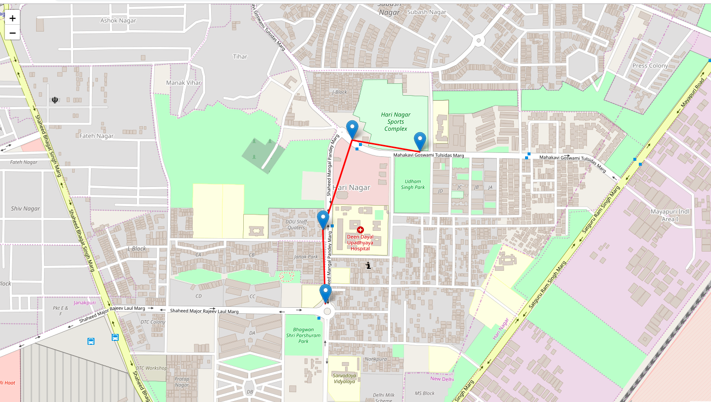

# Bus_Route

A flask Application to find the direct path between the source and destination bus-stops in New Delhi

# How to use

Enter your start station and end station in the textbox and hit the button to get a route of all possible paths
after the current time 

# Running

First, install requirement files from the requirements.txt file

`flask run` in the root of the directory

Please note that no pre-processing of the data was done

An example of route-

